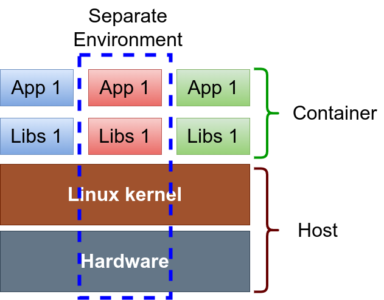
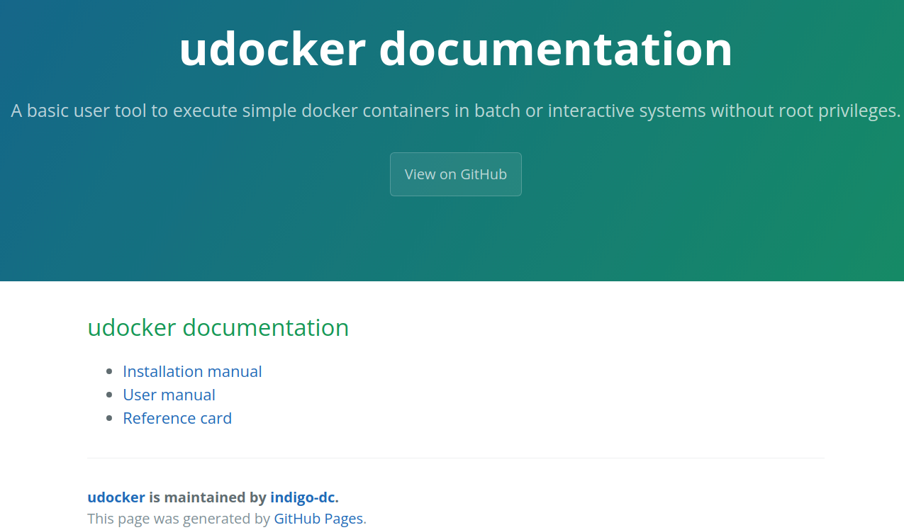
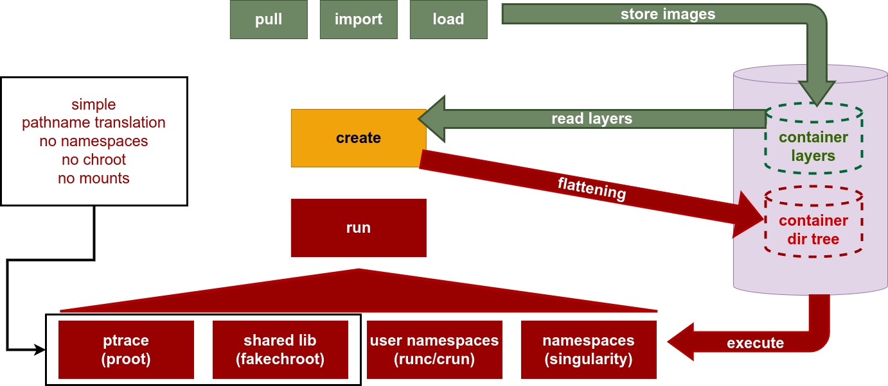
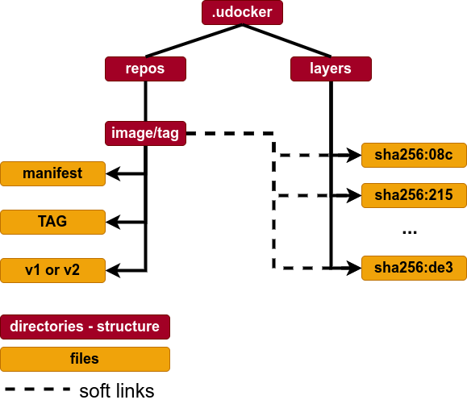
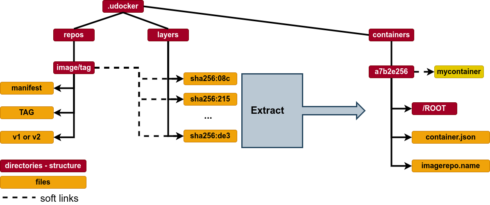
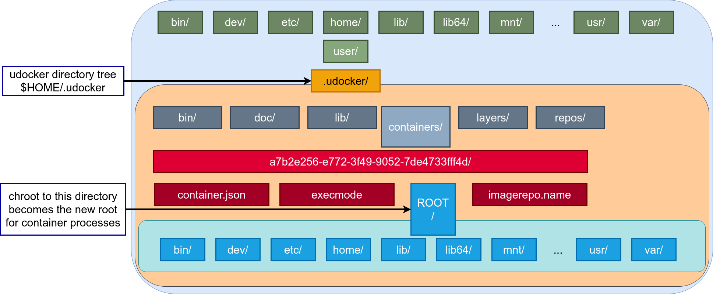
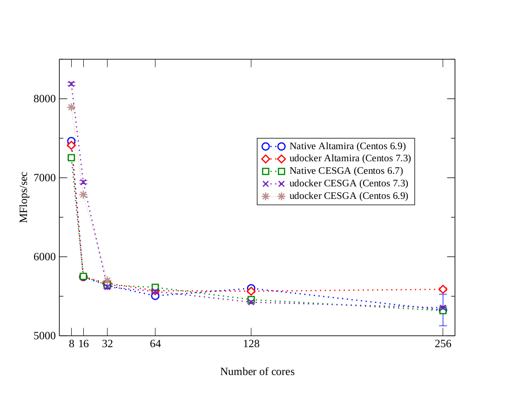
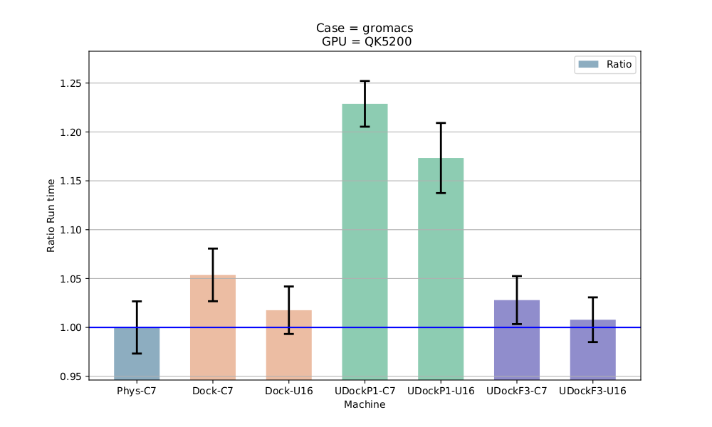

<!-- _class: lead -->

# `udocker`

## Part 1 - Introduction

<https://github.com/indigo-dc/udocker>

Mario David <david@lip.pt>, Jorge Gomes <jorge@lip.pt>

---

## Scientific Computing Challenges I

Running applications across infrastructures often requires considerable effort

* **Heterogeneous Hardware**:
  * Several computing systems
  * Laptops, Desktops, Farms, Cloud, HPC

* **Multiple OSes and distributions**:
  * Several operating systems
  * Linux flavors, Distribution versions

---

## Scientific Computing Challenges II

* **Software Environments**:
  * Specific computing environments.
  * Compilers, Libraries, Customizations, Drivers etc.

* **Applications**:
  * Multiple software codes often combined.

* **Issues**:
  * Portability, Maintainability, Reproducibility.

---

## Using containers for applications I

Encapsulation:

* Applications, dependencies, configurations everything packed together.
* Enables portability across heterogeneous Linux systems.
* Easier distribution and sharing of ready to use software.

Efficiency:

* One single kernel, buffers etc shared by many applications.
* Performance and resource consumption similar to host execution.
* Take advantage of newer more optimized libraries and compilers.

---

## Using containers for applications II

Reproducibility:

* The whole application and run-time environment is in the container.
* Can be easily stored for later replay, reuse and preservation.

Maintainability:

* Easier application maintenance, distribution and deployment.
* No need to support applications across multiple OS distributions.
* Independance from software changes at the host level.

---

## `udocker` - origin

* Need for a consistent portable way of running applications.

  * Running applications across different distributions and run-time environments.

* `udocker` began to be developed in 2015 in the Indigo-DataCloud project.

  * Proof of concept for running docker containers as a regular user.

* Focused on running scientific applications in Linux systems.

  * Batch or Interactive, HTC or HPC, across sites in grid infrastructures.

---

## Containers for batch processing - I

* Challenges of running containers (docker) on batch systems:

  * Integration with the batch system (how to start/stop containers, etc.).

  * Respect batch system policies (such as quotas, time and resource limits).

  * Respect batch system actions (job management integration delete/kill).

  * Collect accounting (tight integration).

---

## Containers for batch processing - II

* Can we execute in a more simple way?
  * Can we download container images (for instance, from Dockerhub or other registries)?
  * Can we run without a layered filesystem?
  * Can we run without namespaces?
  * Can we run without other complex kernel functionalities ?
  * Can we run as a regular user without privileges?

* When `udocker` started to be developed these were major limitations:
  * Now other tools can also address, at least partially, some of these issues.
    * singularity/apptainer, podman etc..
  * Yet they depend on kernel functionalities, that may not be available everywhere.

---

## `udocker`: Introduction - I

* `udocker` can run applications encapsulated in docker containers **Without**:
  * Using docker.
  * Requiring (root) privileges.
  * System administrators intervention.
  * Additional system software.
  * Requiring Linux namespaces.

* Everything runs in user space:
  * As a regular user without privileges.
  * Subjected to the normal process controls and accounting.
  * Both in interactive or batch systems.

---

## `udocker`: Introduction - II

* `udocker` is open source.

* Developed under the Indigo-Datacloud, DEEP Hybrid-Datacloud, EOSC-Synergy, BigHPC
  and DT-Geo projects.

* Github repository: <https://github.com/indigo-dc/udocker>.

* Documentation: <https://indigo-dc.github.io/udocker/>.

---

## `udocker` advantages: Deployment I

* `udocker` is meant to be deployed and used by the end-user:

  * Does not require root privileges.

  * Does not require system administrator intervention.

  * All operations can be performed in user space and in user accessible directories.

  * Deployed by default in the user `$HOME` directory.

  * Containers are in the user `$HOME` directory or other user chosen location.

---

## `udocker` advantages: Deployment II

* `udocker` does not require compilation by the user:
  * Written in Python plus some binaries.
  * Has a minimal set of dependencies.
  * Required binaries are provided statically compiled.

* `udocker` deployment:
  * Just copy and untar into the user `$HOME` directory.
  * Ideal to execute containers across different sites and types of resources and infrastructures.
  * You can deploy `udocker` on the system where you run.

---

## `udocker` advantages: Execution I

* `udocker` integrates several execution engines:
  * Allows execution using multiple different approaches.
  * Allows execution with and without using Linux namespaces.
  * Integrates several tools suitable to execute containers.
  * Makes these tools easier to use across systems.

* `udocker` can be submitted together with a batch job:
  * (Just fetch or ship the `udocker` tarball with the job.)

---

## `udocker` advantages: Execution II

* `udocker` user interface:
  * Commands, syntax and logic are similar or even the same as docker CLI.

* `udocker` empowers users to use containers:
  * Ideal for heterogeneous computing environments.

---

## `udocker`: Command Line Interface

`udocker` is mainly a run-time to execute docker containers:

|          |           |         |         |        |
| -------- | --------- | ------- | ------- | ------ |
| clone    | export    | help    | images  | import |
| inspect  | install   | load    | login   | logout |
| mkrepo   | name      | protect | ps      | pull   |
| rm       | rmi       | rmname  | search  | setup  |
| showconf | unprotect | verify  | version | create |
| run      | save      |         |         |        |

By design `udocker` does not have container creation functionality.
Containers can be created with other tools.

---

<!-- _class: lead -->

# `udocker`: How does it work...

---

## Programing languages and OS

* `udocker` is implemented:
  * Python

* the engines and other tools shipped with `udocker` are binaries:
  * C , C++, go

* Can run:
  * CentOS 7, RHEL8, RHEL9 (compatible distros)
  * Ubuntu >= 16.04
  * Any distro that supports python 2.7 and >= 3.6

---

## Components - I

* The `udocker` Python code (this is what you need to fetch)
  * Command line interface.
  * Dockerhub API.
  * Container and image handling: import, load, save and export.
  * Local images repository.
  * Interface with the execution engines.

---

## Components - II

* `udocker` tools:
  * Pulled and installed upon first invocation of `udocker`.
  * Set of binary executables and libraries that implement the engines.
  * Supporting different OSes and hardware architectures.
  * Executables: proot (Pn), runc (Rn), crun (Rn) and patchelf (Fn).
  * Libraries: fakechroot (Fn).

---

## `udocker` in 4 steps - I

Step 1 - Installation:

* Get the `udocker` tarball using `curl`, `wget` or a browser.
* Extract the content of the tarball.
* No need to compile software.
* The first time `udocker` is run it will fetch the required binaries.

---

## `udocker` in 4 steps - II

Step 2 - Get container images:

* Pull containers from docker compatible repositories.:
  * `udocker pull`
* Load and save in docker and OCI formats:
  * `udocker load`
  * `udocker save`
* Import and export tarballs:
  * `udocker import`
  * `udocker export`

---

## `udocker` in 4 steps - III

Step 3 - Create from images:

* Create the container directory tree from the image:
  * `udocker create`

Step 4 - Execute containers:

* Run using several execution methods:
  * `udocker run`

---

## `udocker` in 4 steps - IV

The steps to fetch and execute containers are important:

* `udocker pull <IMAGE>`
* `udocker create <IMAGE>`
* `udocker run <CONTAINER-ID-OR-NAME>`
* `udocker run <CONTAINER-ID-OR-NAME>`
* `udocker run <CONTAINER-ID-OR-NAME>`

The created container can be run as many times as you wish.

* You may call `udocker run` directly but this will create a new CONTAINER every-time.
* Will be slow and occupy much more space.

---

## `udocker` is an integration tool

---

## `udocker`: pull - Images I

* Docker images are composed of:
  * Metadata describing the images content and how to run.
  * Multiple file-system layers stored as tarballs.

* `udocker` pulls the metadata and layers:
  * Using the DockerHub REST API.
  * Image metadata is parsed to identify the layers.
  * Layers are stored in the user home directory under `${UDOCKER_DIR}/.udocker/layers`
  * Image information with links to the layers is under `${UDOCKER_DIR}/.udocker/repos`

---

## `udocker`: pull - Images II

---

## `udocker`: Create containers - I

* Containers are produced from the images in a process called flattening.
  * Each image layer is extracted on top of the previous.
  * UnionFS Whiteouts are applied before each layer extraction.
  * Protection changes are applied to make files accessible.
  * The resulting directory tree is stored under `${UDOCKER_DIR}/.udocker/containers`

* Accessing files is easy:
  * just cd into `${UDOCKER_DIR}/.udocker/containers/CONTAINER-ID/ROOT`.
* The creation can be slow depending on underlying filesystem (e.g. Lustre, GPFS):
  * Alternative use the /tmp or some partition local to the host.

---

## `udocker`: Create containers - II

---

## `udocker`: Run container

---

## `udocker`: Execution engines I

* Like in other container tools execution is achieved by providing `chroot` like functionality.
* `udocker` supports several techniques to achieve the equivalent to a `chroot` without using privileges.
* These techniques can be selected per container via execution modes implemented by execution engines.

---

## `udocker`: Execution engines II

| Mode  | Base        | Description                                                  |
| :---: | :---------: | :----------------------------------------------------------: |
| P1    | PRoot       | PTRACE accelerated (with SECCOMP filtering): *DEFAULT*       |
| P2    | PRoot       | PTRACE non-accelerated (without SECCOMP filtering)           |
| R1    | runC        | rootless unprivileged using user namespaces                  |
| R2    | runC        | rootless unprivileged using user namespaces + P1             |
| R3    | runC        | rootless unprivileged using user namespaces + P2             |
| F1    | Fakechroot  | with loader as argument and LD_LIBRARY_PATH                  |
| F2    | Fakechroot  | with modified loader, loader as argument and LD_LIBRARY_PATH |
| F3    | Fakechroot  | modified loader and ELF headers of binaries + libs changed   |
| F4    | Fakechroot  | modified loader and ELF headers dynamically changed          |
| S1    | Singularity | where locally installed using chroot or user namespaces      |

---

## Selection in terms of performance

| Mode  | Base        | Description                                                                                     |
| :---: | :---------: | :---------------------------------------------------------------------------------------------: |
| P1    | PRoot       | System call intensive applications may suffer degradation                                       |
| P2    | PRoot       | Same limitations as P1 apply. All system calls are traced causing higher overheads than P1      |
| R1    | runC        | Same performance as namespace based applications                                                |
| R2    | runC        | Only for software installation and similar. Same performance as P1                              |
| R3    | runC        | Only for software installation and similar. Same performance as P2                              |
| F1    | Fakechroot  | All Fn modes have similar performance during execution. Frequently the Fn modes are the fastest |
| F2    | Fakechroot  | Same as F1                                                                                      |
| F3    | Fakechroot  | Same as F1. Setup can be very slow                                                              |
| F4    | Fakechroot  | Same as F1. Setup can be very slow                                                              |
| S1    | Singularity | Similar to Rn                                                                                   |

---

## Selection in terms of interoperability I

| Mode  | Base        | Description                                                                                                               |
| :---: | :---------: | :-----------------------------------------------------------------------------------------------------------------------: |
| P1    | PRoot       | PTRACE + SECCOMP requires kernel >= 3.5. Can fall back to P2 if SECCOMP is unavailable                                    |
| P2    | PRoot       | Runs across a wide range of kernels even old ones. Can run with kernels and libraries that would fail with kernel too old |
| R1    | runC        | User namespace limitations apply                                                                                          |
| R2    | runC        | User namespace limitations apply. Same limitations as P1 also apply, this is a nested mode P1 over R                      |
| R3    | runC        | User namespace limitations apply. Same limitations as P2 also apply, this is a nested mode P2 over R                      |

---

## Selection in terms of interoperability II

| Mode  | Base        | Description                                                                                            |
| :---: | :---------: | :----------------------------------------------------------------------------------------------------: |
| F1    | Fakechroot  | May escape and load host libraries. Requires shared library compiled against same libc as in container |
| F2    | Fakechroot  | Same as F1                                                                                             |
| F3    | Fakechroot  | Requires shared library compiled against same libc as in container. Binary executables and libraries  get tied to the user HOME pathname |
| F4    | Fakechroot  | Same as F3. Executables and libraries can be compiled or added dynamically                             |
| S1    | Singularity | Not part of `udocker` must already exist on the system, may use user namespaces or chroot              |

---

<!-- _class: lead -->

# `udocker`: Running applications ...

---

## `udocker` & Lattice QCD

OpenQCD is a very advanced code to run lattice simulations.

Scaling performance as a function of the cores for the computation of application of the Dirac operator to a spinor field.

Using OpenMPI, `udocker` in P1 mode.

---

## `udocker` & Molecular dynamics

Gromacs is widely used both in biochemical and non-biochemical systems.

In this comparison Gromacs was run using CUDA and OpenMP:

* `udocker` using P mode has lower performance with Gromacs.
* `udocker` using F mode has same or better performance as Docker.

---

## `udocker` & Phenomenology

MasterCode connects several complex codes:

* Hard to deploy.
* Scanning through large parameter spaces.
* High Throughput Computing.
* C++, Fortran, many authors, legacy code.

Performance Degradation (*udocker in P1 mode*)
  
| Environment | Compiling | Running |
| :---------: | :-------: | :-----: |
| HOST        |  0%       |   0%    |
| DOCKER      | 10%       | 1.0%    |
| udocker     |  7%       | 1.3%    |
| VirtualBox  | 15%       | 1.6%    |
| KVM         |  5%       | 2.6%    |

---

<!-- _class: lead -->

# Thank you!

## Questions ?

<udocker@lip.pt>

---

<!-- _class: lead -->

# Backup slides

---

## Other container technologies

* Singularity/Apptainer (LBL) <https://apptainer.org/> - `udocker` currently supports it as execution mode.
* Charliecloud (LANL) <https://charliecloud.io/>.
* Shifter (NERSC) <https://docs.nersc.gov/development/containers/shifter/how-to-use/>.
* Podman (RedHat) <https://www.redhat.com/en/topics/containers/what-is-podman>.
