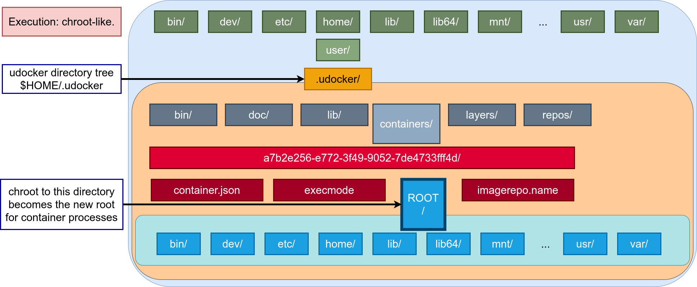

<!-- _class: lead -->

# udocker

## *be anywhere*

<https://github.com/indigo-dc/udocker>

Mario David <david@lip.pt>
Jorge Gomes <jorge@lip.pt>

---

## Containers in Scientific Computing I

Running applications across infrastructures may require considerable effort

* **Computers**:
  * Several computing systems
  * Laptops, Desktops, Farms, Cloud, HPC

* **OSes**:
  * Several operating systems
  * Linux flavors, Distribution versions

---

## Containers in Scientific Computing II

* **Environments**:
  * Specific computing environments
  * Compilers, Libraries, Customizations

* **Applications**:
  * Multiple applications often combined
  * Portability, Maintainability, Reproducibility

---

## udocker - beginnings

Need a consistent portable way of running applications.

udocker began to be developed in 2015 Indigo-DataCloud project.

Focused on running scientific applications in Linux clusters.

---

## Containers for batch processing - I

* Challenges of batch systems?
  * Integrate it with the batch system (how to start/stop etc) ?
  * Respect batch system policies (such as quotas/limits) ?
  * Respect batch system actions (job delete/kill) ?
  * Collect accounting ?

---

## Containers for batch processing - II

* Can we execute in a more basic way?
  * Can we download container images?
  * Can we run without a layered filesystem?
  * Can we run them as normal user?
  * Can we still enforce container metadata?

---

## udocker: Introduction - I

* Run applications encapsulated in docker containers:
  * without using docker
  * without using (root) privileges
  * without system administrators intervention
  * without additional system software
  * does not require Linux namespaces

* Run:
  * as a normal user
  * with the normal process controls and accounting
  * in interactive or batch systems

---

## udocker: Introduction - II

* udocker is open source.

* Developed under the Indigo-Datacloud, DEEP Hybrid-Datacloud, EOSC-Synergy and BigHPC projects.

* Github repository: <https://github.com/indigo-dc/udocker>.

* Documentation: <https://indigo-dc.github.io/udocker/>.

---

## udocker advantages: deployment I

* udocker can be deployed and used by the end-user:
  * Does not require privileges.
  * Does not require system administrator intervention.
  * All operations performed in user space.

---

## udocker advantages: deployment II

* udocker does not require compilation:
  * Uses Python plus some binaries.
  * Has a minimal dependencies.
  * Required executables are provided statically compiled.

* udocker deployment:
  * Just copy and untar into the user home directory.
  * Ideal to execute containers across different sites.

---

## udocker advantages: execution I

* udocker integrates several execution engines:
  * Allows execution with several approaches/engines.
  * Allows execution with and without Linux namespaces.

* udocker can be submitted with the batch job:
  * Just fetch or ship the udocker tarball with the job.

---

## udocker advantages: execution II

* udocker user interface:
  * Commands and logic similar to docker.

* udocker empowers users to use containers:
  * Ideal for heterogeneous computing environments.

---

## udocker: CLI

Run time to execute docker containers:

|          |           |         |         |        |
| -------- | --------- | ------- | ------- | ------ |
| clone    | export    | help    | images  | import |
| inspect  | install   | load    | login   | logout |
| mkrepo   | name      | protect | ps      | pull   |
| rm       | rmi       | rmname  | search  | setup  |
| showconf | unprotect | verify  | version | create |
| run      | save      |         |         |        |

---

<!-- _class: lead -->

# udocker: How does it work...

---

## Programing languages and OS

* Implemented
  * python, C, C++, go

* Can run:
  * CentOS 6, CentOS 7, RHEL8 (compatible distros)
  * Ubuntu >= 16.04
  * Any distro that supports python 2.6, 2.7 and >= 3.6

---

## Features

* Components:
  * Command line interface docker like
  * Pull of containers from Docker Hub
  * Local repository of images and containers
  * Execution of containers with modular engines

---

## udocker in 4 steps - I

1 - Installation:

* Get the udocker tarball and untar.
* No need to compile software.

2 - Get container images:

* Pull containers from docker compatible repositories.
* Load and save docker and OCI formats.
* Import and export tarballs.

---

## udocker in 4 steps - II

3 - Create from images:

* Create the container directory tree from the image.

4 - Execute containers:

* Run using several execution methods.

---

## udocker is an integration tool

---

## udocker: pull - Images

* Layers and metadata are pulled with DockerHub REST API.

* Image metadata is interpreted to identify the layers.

* Layers are stored in the use home directory under `${UDOCKER_DIR}/.udocker/layers`.
  so that can be share by multiple images.

---

## udocker: Create containers - I

* Are produced from the layers by flattening them.

* Each layer is extracted on top of the previous.

* Whiteouts are respected, protections are changed.

* The obtained directory trees are stored under `${UDOCKER_DIR}/.udocker/containers`
  in the user home directory.

---

## udocker: Create containers - II

---

## udocker: Run container

---

## udocker: Execution engines

udocker supports several techniques to achieve the equivalent to a chroot without using privileges, they are selected per container id via execution modes

| Mode  | Base        | Description |
| :---: | :---------: | :---------: |
| P1    | PRoot       | PTRACE accelerated (with SECCOMP filtering): *DEFAULT* |
| P2    | PRoot       | PTRACE non-accelerated (without SECCOMP filtering) |
| R1    | runC        | rootless unprivileged using user namespaces |
| F1    | Fakechroot  | with loader as argument and LD_LIBRARY_PATH |
| F2    | Fakechroot  | with modified loader, loader as argument and LD_LIBRARY_PATH |
| F3    | Fakechroot  | modified loader and ELF headers of binaries + libs changed |
| F4    | Fakechroot  | modified loader and ELF headers dynamically changed |
| S1    | Singularity | where locally installed using chroot or user namespaces |

---

<!-- _class: lead -->

# udocker: Running applications ...

---

## udocker & Lattice QCD

OpenQCD is a very advanced code to run lattice simulations

Scaling performance as a function of the cores for the computation of application of the Dirac operator to a spinor field.

Scaling performance as a function of the cores for the computation of application of the Dirac operator to a spinor field.

Using OpenMPI, udocker in P1 mode

---

## udocker & udocker & Molecular dynamics

Gromacs is widely used both in biochemical and non-biochemical systems. 

udocker P mode have lower performance, udocker F mode same as Docker.

Using CUDA and OpenMP

---

## udocker & Phenomenology

MasterCode connects several complex codes. Hard to deploy.

Scanning through large parameter spaces. High Throughput Computing.

C++, Fortran, many authors, legacy code.

Performance Degradation (*udocker in P1 mode*)
  
| Environment | Compiling | Running |
| :---------: | :-------: | :-----: |
| HOST        |  0% |   0% |
| DOCKER      | 10% | 1.0% |
| udocker     |  7% | 1.3% |
| VirtualBox  | 15% | 1.6% |
| KVM         |  5% | 2.6% |

---

<!-- _class: lead -->

# udocker: Next

---

## udocker: What’s next

* Increase automation for MPI/infiniband applications:
  * OpenMPI and MPICH.

* Better translation of “volume” directories.

* Command line interface enhancements.

* Improve which binaries and libraries are installed, dependent on host OS and architecture.

* Improve root emulation.

---

## Other container technologies

* Singularity (LBL) - udocker currently supports it as execution mode

* Charliecloud (LANL) - devels contacted Jorge: can udocker have a mode for it?
  "Merge" the udocker, CLI functionality with underlying charlicloud engine?

* Shifter (NERSC) - at the moment no plans on any type of usage/integration in udocker.

* Podman (RedHat)
