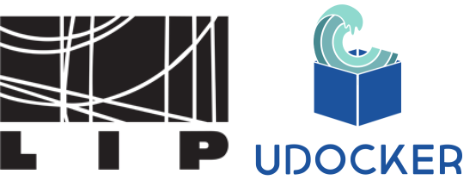

<!-- _class: lead -->

# udocker - *be anywhere*

## Part 4 - Hands On: submission to SLURM clusters

<https://github.com/indigo-dc/udocker>

Mario David <david@lip.pt>, Jorge Gomes <jorge@lip.pt>

---

---

<!-- _class: lead -->

# End of Hands On part III

