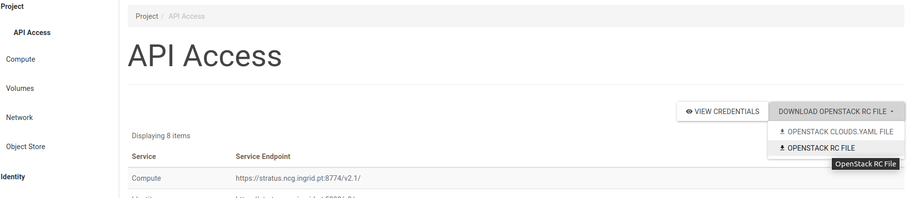

# Infrastructure as Code (IAC)

## Introduction
In this tutorial, we will show how to deploy a set of Virtual Machines (VMs)
in an Openstack cloud infrastructure using terraform, and deloying
a kubernetes cluster with ansible.

## Installing terraform

Download and install terrafrom from:
[https://www.terraform.io/downloads.html](https://www.terraform.io/downloads.html).

It's a zip file with the terraform executable that you can put in `/usr/local/bin`,
you will need root previledges to do so: `sudo -s`.

## Using Terraform with Openstack provider

You can obtain the Openstack environment variables from the Openstack Dashboard, that
you have access to:



The content should be similar to this:

```bash
#!/usr/bin/env bash
# To use an OpenStack cloud you need to authenticate against the Identity
# service named keystone, which returns a **Token** and **Service Catalog**.
# The catalog contains the endpoints for all services the user/tenant has
# access to - such as Compute, Image Service, Identity, Object Storage, Block
# Storage, and Networking (code-named nova, glance, keystone, swift,
# cinder, and neutron).
#
# *NOTE*: Using the 3 *Identity API* does not necessarily mean any other
# OpenStack API is version 3. For example, your cloud provider may implement
# Image API v1.1, Block Storage API v2, and Compute API v2.0. OS_AUTH_URL is
# only for the Identity API served through keystone.
export OS_AUTH_URL=https://<openstack_keystone_fqdn>:5000/v3/
# With the addition of Keystone we have standardized on the term **project**
# as the entity that owns the resources.
export OS_PROJECT_ID=<PROECT_ID>
export OS_PROJECT_NAME="<OPENSTACK_PROJECT>"
export OS_USER_DOMAIN_NAME="Default"
if [ -z "$OS_USER_DOMAIN_NAME" ]; then unset OS_USER_DOMAIN_NAME; fi
export OS_PROJECT_DOMAIN_ID="default"
if [ -z "$OS_PROJECT_DOMAIN_ID" ]; then unset OS_PROJECT_DOMAIN_ID; fi
# unset v2.0 items in case set
unset OS_TENANT_ID
unset OS_TENANT_NAME
# In addition to the owning entity (tenant), OpenStack stores the entity
# performing the action as the **user**.
export OS_USERNAME="<YOUR_USERNAME>"
# With Keystone you pass the keystone password.
echo "Please enter your OpenStack Password for project $OS_PROJECT_NAME as user $OS_USERNAME: "
read -sr OS_PASSWORD_INPUT
export OS_PASSWORD=$OS_PASSWORD_INPUT
# If your configuration has multiple regions, we set that information here.
# OS_REGION_NAME is optional and only valid in certain environments.
export OS_REGION_NAME="RegionOne"
# Don't leave a blank variable, unset it if it was empty
if [ -z "$OS_REGION_NAME" ]; then unset OS_REGION_NAME; fi
export OS_INTERFACE=public
export OS_IDENTITY_API_VERSION=3
```

## Deployment of a Kubernetes cluster

Terraform templates will be used to instantiate 3 VMs in an Openstack cloud
infrastructure and after, Ansible playbooks will be used to install, configure
and start the cluster. The cluster has one master (k8s-master) and 2 nodes (k8s-node).

### VMs instantiated with terraform

Go to the `tf-k8s` directory:

```bash
cd tf-k8s/
```

Source the Openstack credentials, for example:

```bash
source user-openrc.sh
```

The `variables.tf` should be changed accordingly. You can get the list of Openstack
flavors to fill the variables `flavor_k8s_master` and `flavor_k8s_node`:

```bash
openstack flavor list
```

The list of images for the variable `image` can be obtained with:

```bash
openstack image list
```

The terraform template will deploy one kubernetes master, and a number of
kubernetes nodes specified in variables `nnodes` and `ns`, these 2 variables should
match.

The terraform `resource "local_file" "AnsibleInventory"` is used to produce automatically
an ansible inventory file for the kubernetes cluster, filling the yet unknown private
IPs of the k8s nodes, and the public IP of the k8s master.

Initialize the provider:

```bash
terraform init
```

If this `Error: Failed to install providers` appear, follow the suggestion, and execute
init again:

```bash
terraform 0.13upgrade .
terraform init
```


Plan the deployment, thiis step is optional and can be used to verify the deployment:

```bash
terraform plan
```

Create the deployment:

```bash
terraform apply
```

In the last step of the terraform template, is the creation of an Ansible
inventory file containing the IPs of the k8s master and nodes ready to be used
in the next step by ansible.

### install, configure and start with Ansible

Change to the `ansible` directory. This directory has an inventory file called
`hosts-k8s` created in the last step of the previous section on running terraform.
It also contains a `ansible.cfg` configuration file. It has 2 ansible playbooks:

* `centos-python-min.yml`: installs a minimal python3 necessary to run
ansible in the hosts
* `k8s.yml`: the playbook that will install and configure the kunernetes cluster.

This latest playbook makes use of 2 roles, that yu should install in the `roles`
directory:

```bash
mkdir -p roles
ansible-galaxy install geerlingguy.docker
ansible-galaxy install geerlingguy.kubernetes
```

[Ansible Galaxy](https://galaxy.ansible.com/) is a public repository for ansible roles.
We are using two of those roles. More information can be found
[here](https://github.com/geerlingguy/ansible-role-kubernetes).

The following step is to execute the ansible playbooks:

```bash
ansible-playbook -i hosts-k8s centos-python-min.yml
ansible-playbook -i hosts-k8s k8s.yml
```

The variables pertaining the roles can be found in the `group_vars/` directory,
where the name of the variables files are the same as the host group name found in
the inventory file, that is *k8s_master* and *k8s_node*:

```bash
cat hosts-k8s 
[k8s_master]
<PublicIP> ansible_user=centos

[k8s_node]
<PrivateIP_0> ansible_user=centos
<PrivateIP_1> ansible_user=centos

[k8s_node:vars]
ansible_ssh_common_args='-o ProxyCommand="ssh -W %h:%p -q centos@<PublicIP>"'

[all:vars]
ansible_python_interpreter=/bin/python3
```

### Kubernetes cluster up and running

Enter into the k8s-master and execute:

```bash
ssh centos@<PublicIP>
sudo -s
kubectl get nodes

NAME                   STATUS   ROLES    AGE   VERSION
k8s-master.novalocal   Ready    master   19m   v1.19.0
k8s-node-0.novalocal   Ready    <none>   18m   v1.19.0
k8s-node-1.novalocal   Ready    <none>   18m   v1.19.0

kubectl cluster-info
kubectl get namespaces
```
